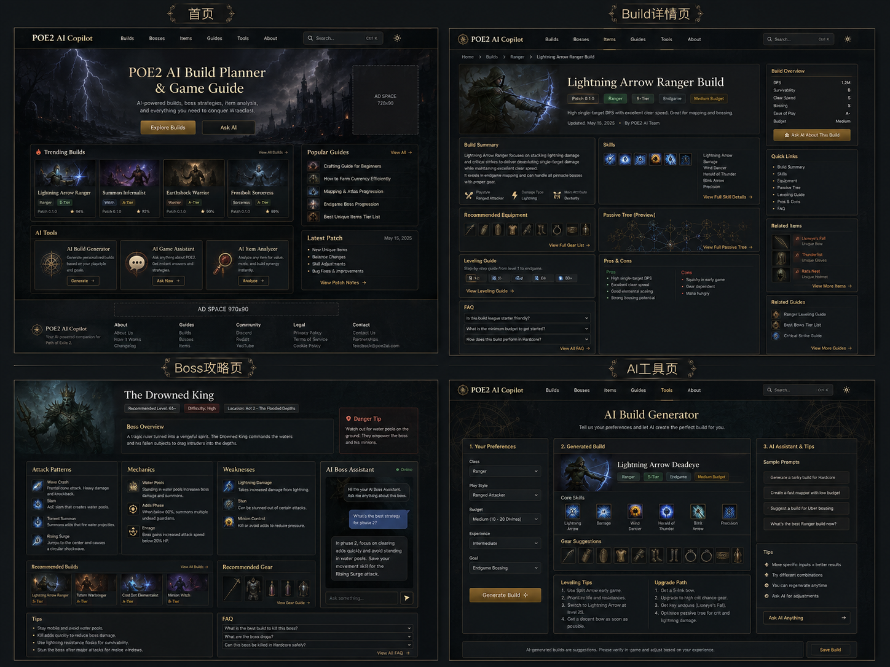

# Exile2 Guides 产品需求文档（PRD）

> **项目类型：** Path of Exile 2 非官方攻略内容站  
> **版本：** MVP v1.0  
> **文档日期：** 2026-07-25  
> **主要读者：** Codex、前端开发、内容编辑、SEO/运营人员  
> **技术方向：** React + TypeScript + React Router Framework Mode + Vite + 静态预渲染  
> **首发语言：** English、简体中文；架构预留更多语言  
> **商业目标：** 首先验证搜索流量和内容需求，网站具备后续申请 Google AdSense 的基础条件

> **需求修订更新时间：** 2026-07-28 00:15（Asia/Shanghai）

### 0.0.1 未完成实机验证内容的首发策略

经运营者明确批准，MVP 首发策略调整为：内容可以在尚未完成 PC 实机验证时进入生产环境、Sitemap 和静态搜索索引。此类内容必须明确标记当前核验状态、适用 Patch、来源和责任审核者，不得伪造实机结果、掉落概率、数值、路线或兼容性结论。

`draft` 仍用于尚未完成编辑、来源或事实整理的工作稿；当内容已经完成编辑审核并获得发布批准，即使实机验证尚未完成，也可以使用 `status: published`，但正文必须清楚说明未完成的实机验证范围。Sitemap 和搜索索引可以收录这类已批准的公开页面。

本修订不允许发布虚构事实、模板占位符、空审核责任、错误版本归因或将未知字段填成确定值。后续实机验证完成后，必须更新页面核验状态、正文边界、更新时间和发布台账。

---

## 0. 文档使用说明

本文件是 MVP 阶段的唯一需求事实源（Single Source of Truth）。Codex 在开始编码前必须完整读取本文件，不得自行扩大产品范围。

第一版只开发**可阅读、可搜索、可被搜索引擎收录的内容站**。除 Cookie 同意、语言、主题和最近浏览等浏览器本地状态外，不保存用户数据。

### 0.1 本版明确包含

- 首页与全站导航
- Builds、Bosses、Items、Skills、Guides、Patch Notes 内容分区
- 分类列表页与内容详情页
- 中英文双语 URL 与内容架构
- 全站搜索（静态索引、浏览器端执行）
- 响应式暗黑奇幻视觉系统
- SEO、结构化数据、站点地图、robots、canonical、hreflang
- About、Contact、Privacy Policy、Terms、Cookie Policy、Disclaimer
- 广告位占位组件与 AdSense 上线前准备，但 MVP 初始不加载广告脚本
- Markdown/MDX 驱动的静态内容系统
- 后续从 Reddit 等社区发现选题的扩展设计

### 0.2 本版明确不包含

- AI Build Generator、AI Chat、AI Item Analyzer 或任何在线模型调用
- 登录、注册、账号、云端收藏、评论、社区
- 数据库、后端业务服务、管理后台
- 积分、订阅、支付、会员
- 实时价格、交易市场、游戏 API 同步
- 用户上传、图片识别、在线 Build 编辑器
- 自动抓取并直接发布第三方内容

### 0.3 原型图



原型图用于确认视觉方向和信息密度。MVP 开发时删除其中所有 AI 工具入口、AI 助手和 AI 工具页，并将相应空间替换为内容导航、最新攻略、版本信息、相关文章或广告占位。

---

# 1. 产品概述

## 1.1 产品名称

### 工作品牌名

**Exile2 Guides**

### 英文描述

**Unofficial Path of Exile 2 Builds, Boss Guides, Items, Skills and Beginner Guides**

### 中文描述

**非官方《Path of Exile 2》Build、Boss、装备、技能与新手攻略站**

### 推荐品牌展示方式

- Logo 主文字：`Exile2 Guides`
- 英文副标：`Path of Exile 2 Builds & Game Guides`
- 中文副标：`Path of Exile 2 攻略与 Build 指南`

### 命名注意事项

“Exile2 Guides”是当前工作名称，不等同于商标法律审查结论。上线前必须完成：

1. 域名可用性检查。
2. 目标市场商标检索。
3. 与现有同类站点名称的混淆风险检查。
4. 确认不会使用“Official”“官方”“Authorized”等造成官方关联误解的词。

网站所有页面 Footer 和 About 页面必须显示：

> Exile2 Guides is an independent, unofficial fan-made website and is not affiliated with or endorsed by Grinding Gear Games. Path of Exile and related marks belong to their respective owners.

中文：

> Exile2 Guides 是独立制作的非官方玩家攻略网站，与 Grinding Gear Games 不存在隶属、授权或背书关系。Path of Exile 及相关标识归其各自权利人所有。

## 1.2 产品定位

Exile2 Guides 是一个以阅读体验和搜索流量为优先的 Path of Exile 2 攻略内容站，帮助玩家快速获得可执行的信息：

- 哪个 Build 适合我？
- 某个 Build 如何配置技能、装备和升级路线？
- 某个 Boss 有哪些阶段、技能和应对方法？
- 某件装备或技能适合哪些玩法？
- 新手如何完成特定系统、任务和终局玩法？
- 当前 Patch 改动对常用 Build 有什么影响？

产品第一阶段不是百科全书，也不是数据库镜像。每个分类先发布 2-3 篇经过核验、信息完整、具有明确搜索意图的内容，验证页面收录、关键词曝光、点击和用户阅读行为，再逐步扩充。

## 1.3 核心价值

1. **清晰：** 页面结构标准化，玩家可快速扫描结论、技能、装备、阶段和注意事项。
2. **准确：** 所有攻略显示适用 Patch、更新时间、核验状态和参考来源。
3. **可执行：** 不只介绍概念，还给出步骤、替代方案、失败原因和检查清单。
4. **多语言：** 同一个内容实体支持英文与中文，后续扩展日语、韩语、德语、法语、西班牙语等。
5. **可持续扩展：** 静态内容文件可以被人工、脚本或未来的内容 Agent 安全生成和审核。

---

# 2. 产品目标与成功标准

## 2.1 MVP 目标

- 用低成本发布一个可以稳定运行的 React 静态内容站。
- 让 Google 等搜索引擎能直接获取每个 URL 的完整 HTML 正文和 Metadata。
- 验证 Builds、Bosses、Items、Skills、Guides、Patch Notes 哪类内容更容易获得曝光。
- 建立未来持续生产内容的页面模板、内容 Schema 和审核流程。
- 达到可以提交 AdSense 审核的产品完整度，但不承诺一定通过审核。

## 2.2 MVP 核心指标

上线后至少持续观察 8-12 周：

- 有效可索引页面数量
- Sitemap 提交页面数、已发现数、已收录数
- Search Console impressions、clicks、CTR、average position
- 自然搜索会话数
- 每个内容分类的入口页流量
- 平均参与时间、滚动深度、退出率
- 内链点击率
- 移动端 Core Web Vitals
- 404、构建失败、破损链接和缺图数量

## 2.3 首发验收目标

- 所有首发 URL 可直接访问，刷新后不回到首页。
- 关闭 JavaScript 后，关键正文仍存在于构建生成的 HTML 中。
- 每个详情页有唯一 title、description、canonical、hreflang、OG 信息。
- 英文和中文页面之间可以互相切换，并指向同一内容实体的对应翻译。
- 页面无“Coming soon”空壳分类进入 Sitemap。
- 每个分类至少有 2 篇、最多先做 3 篇完整内容。
- 全站无登录、支付、AI 调用或数据库依赖。

---

# 3. 用户与使用场景

## 3.1 新手玩家

主要问题：

- 应该选哪个职业或 Build？
- 技能和 Support Gem 怎么搭配？
- 升级期间优先选择什么属性？
- 某个 Boss 为什么一直打不过？
- 进入 Endgame 后先做什么？

页面设计要求：

- 首屏先给一句话结论。
- 专业名词可悬停或点击查看简短解释。
- 使用步骤、阶段标签、推荐/不推荐和替代方案。
- 避免默认玩家已掌握 PoE 1 体系。

## 3.2 回流和中级玩家

主要问题：

- 当前 Patch 哪些 Build 可用？
- 如何从低预算升级到终局配置？
- 不同装备或技能的替代关系是什么？
- 某个 Boss 的关键机制、伤害类型和阶段变化是什么？

页面设计要求：

- 显示 Patch、预算、难度、清图、Boss、坦度等标签。
- 允许快速跳转到 Skills、Equipment、Leveling、FAQ。
- 提供相关 Build、相关 Skill、相关 Item 和相关 Guide 内链。

## 3.3 搜索引擎访客

用户通常通过具体查询进入详情页，而不是先进入首页。例如：

- `path of exile 2 beginner ranger build`
- `poe2 boss name guide`
- `poe2 skill name support gems`
- `path of exile 2 leveling guide`

因此每个详情页必须是独立、完整、无需依赖前序页面即可理解的落地页。

---

# 4. MVP 范围与首发内容数量

## 4.1 页面类型

| 分区 | 列表页 | 详情页 | MVP 首发内容 |
|---|---:|---:|---:|
| Home | 1 | - | 1 |
| Builds | 1 | 有 | 2-3 篇 |
| Bosses | 1 | 有 | 2-3 篇 |
| Items | 1 | 有 | 2-3 篇 |
| Skills | 1 | 有 | 2-3 篇 |
| Guides | 1 | 有 | 2-3 篇 |
| Patch Notes | 1 | 有 | 1-2 篇 |
| Search | 1 | - | 1 |
| Legal/Trust | - | 有 | 6 页 |
| Error | - | 404 | 1 |

预计首发可索引页面约 20-28 个，而不是一开始生产 100 个页面。

## 4.2 首发内容选题原则

每类只选择：

- 有明确搜索需求的主题。
- 能在当前 Patch 下核验的主题。
- 可以写出完整步骤和实用结论的主题。
- 与其他首发内容可以形成内链关系的主题。

示例名称仅用于开发演示，正式发布前必须根据届时实际 Patch 和游戏内容完成编辑与来源审核；不得将虚构的 Boss、物品、技能或数值作为真实内容发布。实机验证尚未完成时，允许发布已批准的事实边界和核验计划，但不得伪造实测结果。

## 4.3 空分类处理

- 分类若没有至少 2 篇已发布内容，不进入主导航。
- 未获批准的页面必须 `noindex`，且不进入 Sitemap；已批准但尚未完成实机验证的公开页面可以进入 Sitemap 和搜索索引，并必须显式显示核验状态。
- 禁止使用大量只有标题、三句话或占位图的页面填充数量。

---

# 5. 信息架构与 URL

## 5.1 多语言 URL 方案

采用子目录，不采用 Cookie 决定唯一内容，也不采用二级域名：

```text
/en/
/zh-cn/
```

未来扩展：

```text
/ja/
/ko/
/de/
/fr/
/es/
```

根路径 `/` 行为：

- 首次访问根据 `Accept-Language` 给出轻量推荐，但不得强制把搜索引擎或用户重定向到无法切换的语言。
- 推荐方案：根路径展示简洁语言选择，或 302 到默认英文 `/en/`。
- 用户主动选择语言后，将偏好保存到 LocalStorage 或必要 Cookie。
- 每种语言必须拥有独立 URL。

## 5.2 路由结构

```text
/
├── /en/
│   ├── builds/
│   │   └── :slug/
│   ├── bosses/
│   │   └── :slug/
│   ├── items/
│   │   └── :slug/
│   ├── skills/
│   │   └── :slug/
│   ├── guides/
│   │   └── :slug/
│   ├── patches/
│   │   └── :slug/
│   ├── search/
│   ├── about/
│   ├── contact/
│   ├── privacy-policy/
│   ├── terms-of-use/
│   ├── cookie-policy/
│   └── disclaimer/
└── /zh-cn/
    └── 与英文结构一致
```

## 5.3 URL 规范

- 全小写。
- 单词使用短横线。
- 不包含日期，除非 Patch 页面确实需要版本标识。
- Slug 尽量稳定，不因标题微调改变。
- 不在 URL 中使用查询参数表达核心内容实体。
- 每个内容实体有内部稳定 `contentId`，翻译版本共享该 ID。

示例：

```text
/en/builds/lightning-arrow-ranger/
/zh-cn/builds/lightning-arrow-ranger/
```

中文页面 Slug 第一版仍使用英文稳定 Slug，降低路由、迁移和 hreflang 管理复杂度。

---

# 6. 全站视觉与布局规范

## 6.1 设计方向

基于已确认原型，采用“暗黑奇幻 + 专业内容站”风格，而不是复刻游戏客户端。

关键词：

- 深灰黑背景
- 少量青灰石材纹理
- 金色、铜色强调
- 清晰的白色/浅灰正文
- 卡片边框克制，避免每个模块都过度装饰
- 信息密度较高，但保留可读间距
- 图标辅助扫描，不依赖图标传递唯一信息

## 6.2 禁止事项

- 不复制官方 Logo、界面、字体、角色立绘或 UI 资产。
- 不使用未经许可的官方宣传图作为全站大背景。
- 不使用闪烁、粒子、自动播放视频影响阅读。
- 不为追求“游戏感”牺牲正文对比度和字号。
- 不在移动端保留三栏窄内容。

## 6.3 建议设计 Tokens

```ts
export const tokens = {
  colors: {
    bg: '#0B0E10',
    surface: '#11161A',
    surfaceRaised: '#171D22',
    border: '#34302A',
    borderStrong: '#6A5632',
    text: '#ECE7DC',
    textMuted: '#A8A39A',
    gold: '#C39A55',
    goldHover: '#D8B673',
    danger: '#C76A5A',
    success: '#72A77A',
    info: '#6F91B8'
  },
  radius: {
    sm: '4px',
    md: '8px',
    lg: '12px'
  },
  content: {
    maxWidth: '1280px',
    articleWidth: '800px'
  }
};
```

上述颜色是起始值，Codex 可微调对比度，但必须通过 WCAG 对比度检查。

## 6.4 字体

- UI/正文：高可读无衬线字体。
- 标题：可使用具备奇幻气质但易读的衬线字体，且必须为可合法商用的 Web Font。
- 正文桌面端建议 16-18px，行高 1.65-1.8。
- 移动端正文不小于 16px。
- 不允许把装饰字体用于大段正文。

## 6.5 全局布局

### Desktop

- 最大内容宽度：1200-1320px。
- 详情页主要采用 `主内容 + 右侧栏`。
- 主内容约 72%-76%，侧栏约 24%-28%。
- 侧栏只用于目录、关键属性、相关内容和广告占位。

### Tablet

- 内容主栏优先。
- 侧栏移动到正文前方或正文后方，不压缩正文。

### Mobile

- 单列。
- 目录使用折叠组件。
- 表格允许横向滚动或转卡片。
- Header 导航折叠为菜单。
- 首屏不出现占据大面积的广告占位。

---

# 7. 全局组件需求

## 7.1 Header

包含：

- Exile2 Guides Logo 文本。
- Builds、Bosses、Items、Skills、Guides、Patch Notes。
- Search 入口。
- 语言切换。
- 移动端菜单按钮。

行为：

- 桌面端可 Sticky，但高度不超过 72px。
- 当前一级栏目有明确激活态。
- Header 不展示 AI、登录、Pricing。

## 7.2 Footer

必须包含：

- 品牌简介和非官方声明。
- 分类导航。
- About、Contact。
- Privacy Policy、Terms of Use、Cookie Policy、Disclaimer。
- Copyright 年份。
- 可选社交链接，但首发无账号时不要放空链接。

## 7.3 Breadcrumb

所有列表页和详情页均显示 Breadcrumb。

示例：

```text
Home > Builds > Lightning Arrow Ranger
```

同时输出 BreadcrumbList JSON-LD。

## 7.4 Content Card

用于 Build、Boss、Item、Skill、Guide 列表。

必须包含：

- 图片或可识别占位图。
- 类型标签。
- 标题。
- 1-2 行摘要。
- Patch 或更新时间。
- 至多 3 个关键属性。

整卡可点击，但卡片内部不得嵌套多个冲突链接。

## 7.5 Table of Contents

- 从正文 H2/H3 自动生成。
- Desktop 侧栏显示。
- Mobile 折叠显示。
- 点击使用锚点平滑跳转。
- 当前阅读章节可高亮。

## 7.6 AdSlotPlaceholder

MVP 初期只渲染开发/预览占位，不加载 Google 脚本。

属性：

```ts
type AdSlotPlaceholderProps = {
  id: string;
  format: 'leaderboard' | 'rectangle' | 'in-article' | 'mobile-banner';
  enabled?: boolean;
};
```

生产环境 `enabled=false` 时不保留大块空白。

## 7.7 LanguageSwitcher

- 尝试跳转到相同 `contentId` 的目标语言页面。
- 若目标语言尚未发布，跳转该语言分类页，并提示“该内容尚未翻译”。
- 不生成指向 404 的 hreflang。

## 7.8 SearchBox

- 支持标题、摘要、标签、分类的本地搜索。
- 结果按语言隔离。
- 支持键盘访问。
- 不保存搜索词到服务器。

---

# 8. 页面详细需求

## 8.1 首页

### URL

- `/en/`
- `/zh-cn/`

### 页面目标

- 明确告诉用户网站提供 Path of Exile 2 攻略。
- 快速进入核心分类。
- 展示最新、热门和适合新手的内容。
- 建立品牌可信度和内容站结构。

### 页面模块顺序

1. Header
2. Hero
3. Featured Builds
4. Latest Guides
5. Boss Guides
6. Skills & Items 快速入口
7. Latest Patch
8. Beginner Start Here
9. 可选广告占位
10. Footer

### Hero

英文 H1：

> Path of Exile 2 Builds, Boss Guides and Beginner Help

英文说明：

> Clear, patch-aware guides for builds, bosses, items, skills and progression.

中文 H1：

> Path of Exile 2 Build、Boss 与新手攻略

CTA：

- Explore Builds
- Start with Beginner Guides

删除原型中的 Ask AI 按钮。

### Featured Builds

- 最多显示 3-4 张卡片。
- 数据来自 `featured: true` 的已发布 Build。
- 无足够内容时，显示 2 张即可，不补空卡片。

### Latest Guides

- 3-6 条。
- 显示标题、类别、更新时间和阅读时长。

### Latest Patch

- 展示当前跟踪版本。
- 显示 3-5 条编辑总结。
- 必须链接到完整 Patch 分析。
- 若尚未完成分析，显示“Official patch notes link”并明确内容状态，不虚构总结。

### 首页 SEO

英文 title 模板：

```text
Exile2 Guides - Path of Exile 2 Builds, Boss Guides & Beginner Help
```

中文 title 模板：

```text
Exile2 Guides - Path of Exile 2 Build、Boss 与新手攻略
```

结构化数据：

- WebSite
- Organization 或 Person（根据实际运营主体选择）
- Breadcrumb 不用于首页

### 验收标准

- 首屏 1440px 桌面下不超过一个主要视觉区 + 核心 CTA。
- 用户在 5 秒内能理解这是 POE2 攻略站。
- 不出现任何 AI 功能或登录入口。

---

## 8.2 Builds 列表页

### URL

`/:locale/builds/`

### 页面目标

帮助用户浏览有限的首发 Build，并为后续内容增长预留筛选结构。

### MVP 筛选

首发内容少，不做复杂多条件系统。只提供：

- Class
- Difficulty
- Budget
- Patch

当结果少于 8 条时，筛选器可以使用轻量 Chips，不使用复杂侧栏。

### Build Card 字段

- title
- className
- ascendancy（可选）
- primarySkill
- difficulty
- budget
- patch
- shortDescription
- image
- updatedAt

### 空状态

筛选无结果时：

- 清晰提示。
- 提供清除筛选按钮。
- 不展示广告。

### SEO

- 列表页必须包含至少 150-300 字人工编辑的分类导语。
- 标题不使用动态筛选参数产生大量可索引变体。
- 筛选状态不进入 Sitemap；参数 URL canonical 回列表页或设置 noindex。

---

## 8.3 Build 详情页

### URL

`/:locale/builds/:slug/`

### 页面目标

完整回答一个 Build 的玩法、适用人群、技能、装备和升级路线。

### 页面结构

1. Breadcrumb
2. Build Hero/Header
3. Quick Summary
4. Build Overview
5. Core Skills
6. Support Skills/Gems
7. Recommended Equipment
8. Passive/Progression Notes
9. Leveling Guide
10. Upgrade Path
11. Gameplay Tips
12. Pros & Cons
13. FAQ
14. Sources & Verification
15. Related Builds/Skills/Items/Guides
16. Footer

### Build Header 字段

- 标题
- 一句话定位
- className
- ascendancy
- patch
- difficulty
- budget
- playstyle
- updatedAt
- verifiedAt
- author/editor

### Quick Summary

用可扫描卡片显示：

- Best For
- Main Damage Type
- Clear Speed（文字等级，不使用伪精确评分）
- Bossing
- Survivability
- Gear Dependency

除非有可复核方法，不得展示“1.2M DPS”“94% rating”等伪造精确数据。

### Skills

每个技能项包括：

- 名称
- 类型
- 作用
- 使用时机
- 推荐 Support
- 替代选择
- 对应 Skill 详情页链接

### Equipment

每个槽位包括：

- 必需属性
- 推荐物品（若有）
- 低预算替代
- 升级方向
- 为什么推荐

禁止仅列物品名称而不解释用途。

### Passive/Progression

MVP 不实现交互式天赋树。允许：

- 原创或合法授权的静态示意图。
- 外部工具链接。
- 关键节点文字说明。
- 等级阶段说明。

### Leveling

最少按 3 阶段：

- Early Campaign
- Mid Campaign
- Endgame Transition

每阶段说明技能、装备属性、资源优先级和常见错误。

### FAQ

- 3-6 个真实问题。
- FAQ 必须在页面可见，不能只写在 JSON-LD。
- 不为了 Schema 批量生成重复问题。

### Sources

页面底部必须包含来源类型：

- Official patch notes
- In-game verification
- Community discussion used for topic discovery
- External planner/tool（如有）

来源只支持事实核验，不允许整段改写或拼接第三方文章。

### 结构化数据

- Article
- BreadcrumbList
- FAQPage（仅当页面有真实 FAQ）

---

## 8.4 Bosses 列表页

### URL

`/:locale/bosses/`

### 分类维度

- Campaign / Endgame
- Act/Area
- Difficulty（Editorial）
- Patch

MVP 内容少时，只显示顶部 Tabs 或 Chips。

### Boss Card

- name
- location
- recommendedLevel（若可核验）
- campaignStage
- primaryDamageTypes
- shortDescription
- updatedAt

禁止用虚构 Boss 作为正式内容。开发 Mock 数据必须标记 `draft: true`，生产构建不发布。

---

## 8.5 Boss 详情页

### URL

`/:locale/bosses/:slug/`

### 页面结构

1. Breadcrumb
2. Boss Header
3. Quick Preparation
4. Boss Overview
5. Attack Patterns
6. Fight Phases
7. Key Mechanics
8. Weaknesses / Effective Approaches
9. Defensive Preparation
10. Step-by-Step Strategy
11. Common Failure Reasons
12. Rewards/Drops（只在可核验时展示）
13. Recommended Related Guides
14. FAQ
15. Sources & Verification

### Attack Pattern 数据

每个攻击：

- attackName
- visualTell
- damageType（未知时标记 unknown）
- dangerLevel（Low/Medium/High，仅编辑判断）
- response
- phase

### Danger Callout

用于原型中的红色提示框：

- 一页最多 2 个。
- 必须是最关键的致死机制。
- 不允许把普通技巧都标为危险。

### Recommended Builds

MVP 不宣称某 Build 是“最佳”，除非有明确依据。使用：

- Builds that handle this mechanic well
- Relevant build characteristics
- 相关 Build 内链

---

## 8.6 Items 列表页

### URL

`/:locale/items/`

### MVP 定位

不是完整物品数据库。只发布具有明确攻略价值的代表性物品、物品类别或选择指南。

### 类型

- Unique Item Guide
- Gear Attribute Guide
- Item Choice Guide
- Crafting Material Explanation

### 列表筛选

MVP 只需：

- Item Type
- Use Case
- Patch

---

## 8.7 Item 详情页

### URL

`/:locale/items/:slug/`

### 页面结构

1. Item Header
2. What It Does
3. Important Modifiers
4. Who Should Use It
5. Builds Using This Item
6. Alternatives
7. How to Obtain（可核验时）
8. Common Misunderstandings
9. FAQ
10. Sources

### 数据准确性

- 数值必须标明 Patch。
- 动态市场价格不进入 MVP。
- 不提供“Keep/Sell”个性化判断。
- 不复制官方物品图标，除非获得合法使用依据；可使用原创槽位图标和文字卡片。

---

## 8.8 Skills 列表页

### URL

`/:locale/skills/`

### Skill Card

- name
- skillType
- damageTypes/tags
- recommendedFor
- requiredLevel（若适用且可核验）
- shortDescription
- patch

---

## 8.9 Skill 详情页

### URL

`/:locale/skills/:slug/`

### 页面结构

1. Skill Header
2. Plain-language Explanation
3. Core Mechanics
4. Scaling
5. Recommended Supports
6. Compatible Playstyles
7. Builds Using This Skill
8. Leveling Use
9. Common Mistakes
10. FAQ
11. Sources

### 写作要求

- 第一段先解释“这个技能实际怎么用”。
- 复杂机制可以用表格，但表格必须在移动端可用。
- 明确区分官方事实、编辑建议和社区常见实践。

---

## 8.10 Guides 列表页

### URL

`/:locale/guides/`

### 初始类别

- Beginner
- Leveling
- Progression
- Currency/Crafting
- Systems

### 首发策略

先做 2-3 篇高需求综合指南，不为每个小问题单独拆薄页。

---

## 8.11 Guide 详情页

### URL

`/:locale/guides/:slug/`

### 页面结构

1. Title/Description
2. Who This Guide Is For
3. Quick Answer
4. Prerequisites
5. Step-by-Step Sections
6. Decision Tables/Checklists
7. Common Mistakes
8. Next Steps
9. FAQ
10. Related Content
11. Sources

### 内容长度

不设置固定字数。以完整解决搜索意图为准。简单问题不强行扩写，复杂指南不能只给摘要。

---

## 8.12 Patch Notes 列表与详情

### URL

```text
/:locale/patches/
/:locale/patches/:slug/
```

### 定位

不复制整篇官方 Patch Notes。详情页提供：

- 官方链接
- 重要变化摘要
- 对已发布 Build/Skill/Item 页面的影响
- 需要复查或暂时标记为 Legacy 的内容

### Patch 内容状态

- `current`
- `supported`
- `legacy`
- `under-review`

当新 Patch 发布但内容未核验时，受影响页面显示：

> This guide is being reviewed for the latest patch. Some details may be outdated.

---

## 8.13 Search 页面

### URL

`/:locale/search/`

### 实现

- 构建时生成每种语言的轻量搜索索引 JSON。
- 浏览器端加载当前语言索引。
- 支持 title、description、tags、headings、category。
- 默认最多显示 20 条，支持继续加载。
- 搜索词只存在于 URL query 和内存，不上传服务器。

### SEO

- Search 结果页 `noindex, follow`。
- 不进入 Sitemap。

---

## 8.14 About

必须说明：

- 网站是什么。
- 为什么建立。
- 内容如何制作和核验。
- 非官方身份。
- 如何报告错误。
- 是否使用 AI 辅助：可以诚实说明 AI 仅用于研究整理/初稿辅助，最终发布内容需编辑核验。

## 8.15 Contact

MVP 可使用：

- 邮箱链接。
- 无后端表单。

若后续使用第三方表单服务，必须更新隐私政策并获取必要同意。

## 8.16 Privacy Policy

必须覆盖：

- 站点使用的 Cookie/LocalStorage。
- 分析工具。
- 未来 AdSense 的 Cookie 和标识符。
- 联系方式。
- 用户隐私选择和撤回入口。
- 第三方链接。

正式文本需根据实际部署工具和运营主体调整，本 PRD 不替代法律意见。

## 8.17 Terms of Use

至少包括：

- 内容仅供参考。
- 游戏更新可能导致内容过时。
- 不保证 Build 或策略结果。
- 知识产权和第三方商标归属。
- 禁止滥用和自动化攻击。
- 外链责任限制。

## 8.18 Cookie Policy

列出实际使用项，禁止复制与实际不一致的模板。

MVP 可能使用：

- 必要 Cookie：同意状态。
- LocalStorage：语言、主题、最近浏览。
- Analytics Cookie：只有在启用并获得适当同意后。
- AdSense Cookie：只有在通过审核并启用广告后。

## 8.19 Disclaimer

单独强调：

- 非官方站点。
- 不隶属于 GGG。
- 游戏名称和商标归权利人。
- 内容不是交易、投资或真钱收益建议。

## 8.20 404

- 返回真实 HTTP 404。
- 显示搜索、热门分类和返回首页。
- 不把未知路径重定向到首页。
- 不进入 Sitemap。

---

# 9. 内容文件与数据模型

## 9.1 内容存储

使用 Markdown 或 MDX 文件存储在仓库中，无数据库。

推荐：

```text
content/
├── en/
│   ├── builds/
│   ├── bosses/
│   ├── items/
│   ├── skills/
│   ├── guides/
│   └── patches/
└── zh-cn/
    └── ...
```

## 9.2 通用 Front Matter

```yaml
---
contentId: build-lightning-arrow-ranger
locale: en
contentType: build
slug: lightning-arrow-ranger
title: Lightning Arrow Ranger Build Guide
seoTitle: Lightning Arrow Ranger Build Guide for Path of Exile 2
seoDescription: A patch-aware Lightning Arrow Ranger guide covering skills, gear priorities, leveling and common mistakes.
summary: A mobile ranged build focused on fast clearing and straightforward progression.
status: published
featured: true
draft: false
patch: "REPLACE_WITH_VERIFIED_PATCH"
patchStatus: current
author: Exile2 Guides Editorial Team
reviewer: ""
publishedAt: 2026-08-01
updatedAt: 2026-08-01
verifiedAt: 2026-08-01
image: /images/builds/lightning-arrow-ranger.webp
imageAlt: An original illustration representing a lightning archer build
tags:
  - ranger
  - lightning
  - beginner
relatedContentIds:
  - skill-lightning-arrow
sources:
  - label: Official patch notes
    url: https://example.invalid/replace-before-publish
    sourceType: official
---
```

构建校验必须拒绝：

- `published` 内容仍包含 `example.invalid`。
- 缺少 title、description、patch 或 updatedAt。
- 同语言重复 slug。
- image 缺少 alt。
- `draft: true` 却进入生产路由或 Sitemap。

## 9.3 Build 特有字段

```yaml
className: Ranger
ascendancy: ""
primarySkill: Lightning Arrow
playstyle:
  - ranged
  - fast-clear
difficulty: beginner
budget: medium
damageTypes:
  - lightning
bestFor:
  - mapping
  - beginners
```

## 9.4 Boss 特有字段

```yaml
location: ""
campaignStage: ""
recommendedLevel: ""
difficulty: high
damageTypes:
  - lightning
phases: 2
```

## 9.5 Item 特有字段

```yaml
itemType: unique-bow
rarity: unique
requiredLevel: ""
useCases:
  - ranged-builds
```

## 9.6 Skill 特有字段

```yaml
skillType: active
tags:
  - projectile
  - lightning
requiredLevel: ""
```

## 9.7 Guide 特有字段

```yaml
guideCategory: beginner
estimatedReadingMinutes: 12
prerequisites: []
```

## 9.8 翻译关系

英文和中文文件共享 `contentId`，但拥有独立：

- title
- seoTitle
- seoDescription
- summary
- body
- updatedAt
- reviewer

翻译不得只是逐句机械翻译。应保持游戏术语一致，并根据语言用户的搜索习惯调整标题和说明。

---

# 10. 内容写作与质量标准

## 10.1 原创价值定义

“原创”不等于每句话从零凭空写，也不等于通过 AI 改写第三方文章。可发布内容必须至少包含以下价值中的两项：

- 实际游戏核验。
- 多来源事实核对。
- 明确的步骤和决策依据。
- 低预算/高预算替代方案。
- 常见失败原因。
- Patch 影响说明。
- 表格、清单、流程或原创示意图。
- 把零散问题整合为完整用户路径。

## 10.2 AI 辅助规则

允许 AI：

- 整理提纲。
- 归纳用户问题。
- 生成初稿。
- 翻译初稿。
- 检查结构缺失。

不允许 AI：

- 在没有来源时生成具体数值、掉落、机制或 Patch 结论。
- 直接改写竞争对手文章。
- 生成大量仅替换职业/技能名称的模板页。
- 自动发布未经核验的内容。
- 伪造作者实测、社区共识或官方说法。

## 10.3 发布检查清单

每篇发布前必须确认：

- 搜索意图明确。
- 一句话结论存在。
- Patch 和更新时间存在。
- 所有事实字段可追溯。
- 没有占位符、虚构数值或未替换示例。
- 标题和正文语言一致。
- 图片有合法来源与 alt。
- 至少 2 个相关内链（首发早期内容不足时可 1 个）。
- 外链使用安全属性。
- Mobile 页面无溢出。
- Schema 与可见正文一致。

## 10.4 内容更新

- 新 Patch 发布后，自动生成受影响页面清单。
- 未完成复核的页面设为 `patchStatus: under-review`。
- 严重过期页面可保留但显示 Legacy 提示。
- 不应为了保持日期新鲜而无实质修改地更新 `updatedAt`。

---

# 11. 后续 Reddit 等社区选题扩展

## 11.1 目标

使用社区内容发现真实问题和高频痛点，而不是复制社区内容生产文章。

## 11.2 合规原则

- 优先使用 Reddit 官方允许的 API、Embed 或人工研究流程。
- 实施前重新阅读届时有效的 Reddit Developer Terms、Data API Terms 和用户内容规定。
- Reddit 用户内容属于发布者，不能默认取得再发布或商业训练权利。
- 不保存用户名、头像、个人资料等不必要个人数据。
- 不全文抓取、拼接或批量改写评论。
- 直接引用时控制在必要范围，提供链接和署名；必要时取得许可。
- 收到删除或权利请求时能定位并移除引用。

## 11.3 推荐工作流

```text
Topic Discovery
  -> Collect post URLs and metadata permitted by terms
  -> Cluster recurring questions
  -> Create editorial brief
  -> Verify facts with official sources/in-game checks
  -> Write original guide
  -> Human review
  -> Publish with source notes
```

## 11.4 只存储最小研究数据

未来若引入抓取/研究脚本，建议只存：

- sourceUrl
- subreddit
- postId
- title
- createdAt
- score snapshot（可选）
- topic tags
- brief summary produced internally
- permission/attribution status

第一版项目不实现该脚本，只在 `/docs/future-content-pipeline.md` 预留设计。

---

# 12. SEO 技术需求

## 12.1 渲染要求

虽然前端使用 React，但公开内容页必须在构建时生成完整静态 HTML。不得只输出一个空 `#root` 后依赖浏览器请求 Markdown 才出现正文。

推荐采用：

- React
- TypeScript
- React Router Framework Mode
- Vite
- React Router `prerender` 配置生成所有公开内容路径

所有内容路由在构建时可枚举并预渲染。

## 12.2 Metadata

每个可索引页必须有：

- `<title>`
- `<meta name="description">`
- canonical
- robots
- Open Graph title/description/image/type/locale
- Twitter Card
- hreflang
- html lang

## 12.3 Title 模板

英文：

```text
{Topic} | Path of Exile 2 {Content Type} - Exile2 Guides
```

中文：

```text
{主题}｜Path of Exile 2 {内容类型} - Exile2 Guides
```

避免所有页面都把品牌放在最前面，核心搜索主题优先。

## 12.4 Canonical

- 每个语言页面 canonical 指向自身同语言 URL。
- 不把中文页面 canonical 到英文页。
- 筛选参数、追踪参数不生成独立 canonical 实体。

## 12.5 hreflang

只为真实存在且可访问的语言版本输出：

```html
<link rel="alternate" hreflang="en" href=".../en/..." />
<link rel="alternate" hreflang="zh-CN" href=".../zh-cn/..." />
<link rel="alternate" hreflang="x-default" href=".../en/..." />
```

## 12.6 Sitemap

生成：

- `/sitemap.xml` 或 Sitemap Index。
- 只包含 canonical、200、indexable、published 页面。
- lastmod 使用真实内容更新时间。
- 不包含搜索结果、草稿、筛选参数和 404。

## 12.7 robots.txt

允许抓取公开内容，声明 Sitemap。不要屏蔽构建所需 JS/CSS。

## 12.8 Structured Data

支持：

- WebSite
- Organization/Person
- Article
- BreadcrumbList
- FAQPage（有真实 FAQ 时）

不要使用 Review/AggregateRating，除非确实有真实评分系统。

## 12.9 Internal Linking

- 每篇详情页至少有上一层分类链接。
- 正文自然链接相关实体。
- 详情页底部显示 2-4 个相关内容。
- 不自动生成几十个无关标签链接。

## 12.10 图片 SEO

- 原创或合法授权。
- WebP/AVIF 优先。
- 明确 width/height，避免布局抖动。
- alt 描述图片内容，不堆关键词。
- 社交分享图与正文图分离。

---

# 13. AdSense 准备需求

## 13.1 原则

MVP 的目标是“具备提交审核的条件”，不是通过页面数量技巧保证审核。

网站必须：

- 有独特、相关、可用的发布者内容。
- 导航清晰。
- 无抓取复制内容。
- 无空白、占位和建设中页面。
- 有隐私说明。
- 广告不伪装成导航、下载或内容按钮。

## 13.2 首发广告策略

- 上线初期不加载 AdSense。
- 只保留逻辑上的广告位置，不显示大块空白。
- 内容稳定、法律页面完成并积累真实页面后再提交审核。

## 13.3 推荐位置

审核通过后才启用：

- 首页内容区块之间 1 个。
- 列表页卡片若干行之后 1 个。
- 详情页正文前半段之后 1 个 in-article。
- 详情页末尾 1 个。
- Desktop 侧栏可选 1 个矩形位。

## 13.4 禁止位置

- Header 主导航内部。
- 与“下一步”“下载”“查看装备”等按钮混淆的位置。
- 只有少量正文的页面。
- 404、Search、Privacy、Terms 等工具/法律页。
- Sticky 广告覆盖正文。
- 首屏广告面积明显高于内容。

## 13.5 Cookie 与同意

启用 Analytics 或广告后：

- 按访问地区展示适用同意管理。
- 提供“Privacy and cookie settings”撤回入口。
- 未获必要同意前不写入非必要 Cookie。
- 隐私政策必须准确披露 Google 产品可能使用 Cookie、Web Beacon、IP 地址或其他标识符。

---

# 14. 浏览器本地状态与隐私

## 14.1 允许的 LocalStorage

```ts
type LocalPreferences = {
  locale?: 'en' | 'zh-cn';
  theme?: 'dark' | 'light' | 'system';
  recentContentIds?: string[];
  cookieSettingsVersion?: string;
};
```

限制：

- 最近浏览最多 20 条。
- 不存储敏感数据。
- 不存储完整搜索历史。
- 提供清除本地数据入口。

## 14.2 Cookie

MVP 未启用 Analytics/Ads 时，原则上只使用必要 Cookie 或完全使用 LocalStorage。

Cookie 必须：

- 设置合理过期时间。
- 使用 SameSite。
- 若无跨站需求，不使用 SameSite=None。
- 生产 HTTPS 下必要时使用 Secure。

---

# 15. React 技术架构

## 15.1 技术选型

- React
- TypeScript（strict）
- React Router Framework Mode
- Vite
- Tailwind CSS 或 CSS Modules（二选一，推荐 Tailwind + CSS Variables）
- Markdown/MDX 解析
- Zod 校验 Front Matter
- ESLint + Prettier
- Vitest
- React Testing Library
- Playwright

## 15.2 为什么不使用普通 Vite SPA

内容站依赖搜索收录和首屏性能。普通 CSR SPA 会把关键内容推迟到 JavaScript 执行后，且部分爬虫不能可靠运行 JavaScript。因此所有公开内容路由必须通过 React Router 的预渲染能力或等效静态生成流程输出完整 HTML。

## 15.3 路由配置要求

构建时：

1. 扫描所有 `published` 内容文件。
2. 生成所有语言的列表页路径。
3. 生成所有详情页路径。
4. 生成法律页、首页和搜索页。
5. 输出静态 HTML、CSS、JS 和搜索索引。

## 15.4 内容加载

- 构建阶段读取文件系统。
- 页面组件接收已解析数据。
- 不在客户端为正文发起 Markdown 请求。
- 客户端只负责交互增强：菜单、目录高亮、筛选、搜索、语言选择。

## 15.5 部署

输出可部署到支持静态文件和自定义 404 的 CDN 平台。

要求：

- HTTPS。
- 正确 MIME。
- 缓存指纹资源。
- HTML 可短缓存或按部署失效。
- 支持 trailing slash 规范。
- 404 返回真实状态码。

## 15.6 环境变量

```text
VITE_SITE_URL=
VITE_SITE_NAME=Exile2 Guides
VITE_DEFAULT_LOCALE=en
VITE_ENABLE_ANALYTICS=false
VITE_ENABLE_ADS=false
VITE_CONTACT_EMAIL=
```

禁止在前端环境变量中存储私钥。

---

# 16. 推荐项目目录

```text
exile2-guides/
├── app/
│   ├── components/
│   │   ├── layout/
│   │   ├── content/
│   │   ├── cards/
│   │   ├── seo/
│   │   ├── ads/
│   │   └── common/
│   ├── routes/
│   │   ├── $locale._index.tsx
│   │   ├── $locale.builds._index.tsx
│   │   ├── $locale.builds.$slug.tsx
│   │   ├── $locale.bosses._index.tsx
│   │   ├── $locale.bosses.$slug.tsx
│   │   ├── $locale.items._index.tsx
│   │   ├── $locale.items.$slug.tsx
│   │   ├── $locale.skills._index.tsx
│   │   ├── $locale.skills.$slug.tsx
│   │   ├── $locale.guides._index.tsx
│   │   ├── $locale.guides.$slug.tsx
│   │   ├── $locale.patches._index.tsx
│   │   ├── $locale.patches.$slug.tsx
│   │   └── $locale.search.tsx
│   ├── styles/
│   ├── root.tsx
│   └── routes.ts
├── content/
│   ├── en/
│   └── zh-cn/
├── public/
│   ├── images/
│   ├── icons/
│   ├── favicon/
│   └── fonts/
├── scripts/
│   ├── validate-content.ts
│   ├── build-search-index.ts
│   ├── check-links.ts
│   └── generate-sitemap.ts
├── lib/
│   ├── content/
│   ├── i18n/
│   ├── seo/
│   ├── schema/
│   └── storage/
├── tests/
├── docs/
├── react-router.config.ts
├── vite.config.ts
├── package.json
└── README.md
```

Codex 可以根据 React Router 实际约定调整文件命名，但不得改变静态预渲染、内容驱动和无后端的原则。

---

# 17. 组件清单

## Layout

- AppShell
- Header
- MobileNavigation
- Footer
- PageContainer
- ArticleLayout
- Sidebar
- Breadcrumbs

## Content

- ArticleHeader
- PatchBadge
- VerificationNotice
- TableOfContents
- MarkdownRenderer
- Callout
- ProsCons
- FAQAccordion
- SourceList
- RelatedContent
- LegacyContentBanner

## Cards

- BuildCard
- BossCard
- ItemCard
- SkillCard
- GuideCard
- PatchCard

## Controls

- FilterChips
- SearchInput
- LanguageSwitcher
- ThemeToggle（可选）
- BackToTop

## SEO

- SeoMeta
- StructuredData
- HreflangLinks

## Ads

- AdSlotPlaceholder
- AdSlot（默认禁用，后续实现）

---

# 18. 多语言需求

## 18.1 第一版语言

- English：默认和主要 SEO 内容。
- 简体中文：同步核心页面。

不要求所有详情页必须同时发布。页面缺翻译时，不输出该语言 hreflang。

## 18.2 UI 文案

UI 字典与内容分离：

```text
locales/
├── en.json
└── zh-cn.json
```

包括导航、筛选、按钮、错误提示、日期格式和 Cookie 文案。

## 18.3 游戏术语

建立术语表：

```yaml
terms:
  Path of Exile 2:
    en: Path of Exile 2
    zh-cn: Path of Exile 2
  build:
    en: Build
    zh-cn: Build
```

对于社区普遍使用英文的术语，可保留英文并给中文解释，避免生硬翻译。

## 18.4 日期与格式

- 英文使用 locale-aware 日期。
- 中文使用 `YYYY年M月D日`。
- 不在内容中写“今天”“最新”而没有具体日期或 Patch。

---

# 19. 性能、可访问性与兼容性

## 19.1 性能预算

目标，不作为绝对保证：

- 初始 JS 尽量低于 180KB gzip。
- 列表和详情页不加载不需要的功能代码。
- LCP 图片优化并预加载。
- CLS < 0.1。
- 正文页面不依赖大型 UI 框架。

## 19.2 图片

- 响应式 `srcset`。
- 懒加载首屏以下图片。
- Hero 图在移动端使用更小尺寸。
- 保留宽高比。

## 19.3 Accessibility

- 正确 Heading 层级，一个页面一个 H1。
- 所有交互可键盘使用。
- Focus 样式明显。
- Accordion 使用正确 aria 属性。
- 图标按钮有 accessible name。
- 不只依赖颜色表达危险、成功或状态。
- 支持 `prefers-reduced-motion`。

## 19.4 浏览器

支持当前主流稳定版本：

- Chrome
- Edge
- Firefox
- Safari
- iOS Safari
- Android Chrome

---

# 20. 分析与监控

## 20.1 初始上线

可以先不启用 Analytics，以减少 Cookie 和隐私复杂度。至少配置：

- Google Search Console
- Bing Webmaster Tools（可选）
- 静态托管平台的匿名基础访问日志（如使用，隐私政策需说明）

## 20.2 后续 Analytics

启用前必须：

- 更新隐私政策。
- 配置同意模式/CMP（按目标地区要求）。
- 不收集不必要的自定义个人标识。

建议事件：

- content_view
- internal_link_click
- search_submit
- filter_change
- language_change
- toc_click
- scroll_50
- scroll_90

---

# 21. QA 与验收

## 21.1 自动化测试

### Unit

- Front Matter Schema。
- URL 生成。
- 翻译映射。
- SEO Title 生成。
- Related Content 匹配。

### Component

- Header/Nav。
- Filters。
- FAQ。
- LanguageSwitcher。
- Search。

### E2E

- 每个分类列表到详情。
- 页面刷新仍正确。
- 语言切换。
- 404。
- Mobile 导航。
- 搜索。

## 21.2 构建门禁

以下任一情况构建失败：

- 发布内容 Schema 不合法。
- 同语言重复路由。
- 发布页面缺 SEO 字段。
- 内部链接指向不存在页面。
- hreflang 指向 404。
- published 内容含占位 URL 或 `TODO`。
- Sitemap 中出现 noindex 页面。

## 21.3 人工验收设备

- 1440px Desktop。
- 1024px Tablet。
- 390px Mobile。
- 320px 最小宽度基本可用。

---

# 22. Codex 开发任务拆解

## Phase 0：准备

### TASK-001 项目初始化

- 初始化 React Router Framework Mode + Vite + TypeScript。
- strict mode。
- ESLint、Prettier、Vitest、Playwright。
- 建立环境变量示例。

### TASK-002 设计系统

- CSS Variables/Tailwind tokens。
- Typography、spacing、color、border、container。
- Story/demo 页面仅开发环境可访问。

## Phase 1：内容基础设施

### TASK-003 内容 Schema

- Zod 定义通用和各类型 Front Matter。
- Markdown/MDX 解析。
- Draft/Published 过滤。

### TASK-004 内容索引

- 按 locale、type、slug、contentId 建立索引。
- Related Content。
- 翻译映射。

### TASK-005 静态预渲染

- 枚举所有公共路径。
- 验证构建 HTML 含正文和 Metadata。

## Phase 2：全局 UI

### TASK-006 Header/Footer

### TASK-007 Breadcrumb/Article Layout/TOC

### TASK-008 Card/Callout/FAQ/Related Content

## Phase 3：页面

### TASK-009 首页

### TASK-010 Builds 列表与详情

### TASK-011 Bosses 列表与详情

### TASK-012 Items 列表与详情

### TASK-013 Skills 列表与详情

### TASK-014 Guides 列表与详情

### TASK-015 Patch 列表与详情

### TASK-016 Search

### TASK-017 法律页与 404

## Phase 4：SEO/i18n

### TASK-018 Metadata/Canonical/hreflang

### TASK-019 Schema/Sitemap/robots

### TASK-020 多语言 UI 与内容切换

## Phase 5：质量

### TASK-021 响应式和无障碍

### TASK-022 性能和图片优化

### TASK-023 自动化测试和构建门禁

### TASK-024 部署文档

### TASK-025 首发内容模板与示例

每种类型只创建 2-3 个经过明确标记的内容文件。示例若未核验必须保持 draft，不得上线。

---

# 23. Codex 执行规则

Codex 必须遵守：

1. 先输出架构确认和任务计划，再开始写代码。
2. 每次只实现一个可测试任务。
3. 不增加数据库、登录、API 服务或 AI SDK。
4. 不把正文留在客户端异步请求中。
5. 不使用官方游戏资产作为占位图。
6. 所有 Mock 内容默认为 Draft。
7. 所有公共路径必须预渲染。
8. 每个任务完成后运行类型检查、Lint 和相关测试。
9. 修改 Schema 时同步更新示例和校验脚本。
10. 不自动生成几十篇内容文件。

## 推荐给 Codex 的启动 Prompt

```text
Read EXILE2-GUIDES-PRD.md completely. Treat it as the single source of truth.
Build only the MVP described in the document: a read-only multilingual React content site with static prerendering. Do not add AI tools, authentication, databases, payments, comments, user uploads, or backend business services.

First:
1. Summarize the architecture and non-goals.
2. Propose the exact package list and file structure.
3. Break implementation into small tasks matching TASK-001 through TASK-025.
4. Identify any conflict between React Router's current official APIs and this PRD.
5. Start with TASK-001 only after producing the plan.

All public content routes must produce complete HTML at build time. Draft or unverified sample content must not be included in production routes, sitemap, or search index.
```

---

# 24. 风险与应对

## 24.1 名称/商标风险

应对：

- 使用独立品牌名。
- 不使用官方 Logo/视觉。
- 加非官方声明。
- 上线前做域名和商标检索。
- 如收到权利人要求，具备快速改名和替换视觉的能力。

## 24.2 内容错误和 Patch 过期

应对：

- 每页 Patch/verifiedAt。
- 新 Patch 下自动 under-review。
- 用户可通过 Contact 报错。
- 不使用虚假精确分数。

## 24.3 AI 批量低质量内容

应对：

- 首发每类 2-3 篇。
- 发布门禁和人工审核。
- 每页必须有原创增量价值。
- Draft 默认不发布。

## 24.4 React SEO 风险

应对：

- 构建时静态预渲染。
- 验证 HTML 源码。
- 不使用纯 CSR 作为公开正文渲染方式。

## 24.5 第三方社区数据风险

应对：

- 使用官方 API/条款允许方式。
- 只做选题发现。
- 不保存不必要个人数据。
- 不复制全文。

## 24.6 低预算内容不足

应对：

- 优先做搜索意图明确的综合页。
- 不开空栏目。
- 通过数据选择下一批内容，而不是一次铺满。

---

# 25. 版本路线

## MVP v1.0

- 阅读型内容站。
- 中英文。
- 2-3 篇/分类。
- React 静态预渲染。
- SEO、法律页、搜索。
- 无广告脚本或仅审核后启用。

## v1.1

- 根据 Search Console 扩充高曝光分类。
- Patch 影响工作流。
- 更好的相关内容和搜索。
- RSS/Atom Feed。

## v1.2

- 合规的 Reddit/社区选题研究工具，内部使用。
- 内容更新提醒。
- 更多语言试点。

## v2（只有流量验证后）

可能考虑：

- 云端 CMS 或 Git-based CMS。
- 用户收藏同步。
- Build Compare。
- 数据库。
- AI 问答或 Build 辅助。
- 会员和付费。

任何 v2 功能必须另立 PRD，不得提前进入 MVP。

---

# 26. 官方参考依据

以下是本 PRD 的产品和技术参考，实施时应重新检查最新版本：

1. Google Search Central - AI-generated content guidance  
   https://developers.google.com/search/blog/2023/02/google-search-and-ai-content
2. Google Search Central - Succeeding in AI search / unique content  
   https://developers.google.com/search/blog/2025/05/succeeding-in-ai-search
3. Google Search Central - JavaScript SEO basics  
   https://developers.google.com/search/docs/crawling-indexing/javascript/javascript-seo-basics
4. Google Search Central - Localized versions and hreflang  
   https://developers.google.com/search/docs/specialty/international/localized-versions
5. Google Search Central - Managing multilingual sites  
   https://developers.google.com/search/docs/specialty/international/managing-multi-regional-sites
6. Google Search Central - Mobile-first indexing  
   https://developers.google.com/search/docs/crawling-indexing/mobile/mobile-sites-mobile-first-indexing
7. Google AdSense - Make sure your site's pages are ready  
   https://support.google.com/adsense/answer/7299563
8. Google Publisher Policies  
   https://support.google.com/adsense/answer/10502938
9. Google AdSense - Required content / privacy disclosures  
   https://support.google.com/adsense/answer/1348695
10. React - Build a React app from scratch  
    https://react.dev/learn/build-a-react-app-from-scratch
11. React Router - Static generation/prerender documentation and current release notes  
    https://reactrouter.com/
12. Vite official documentation  
    https://vite.dev/
13. Grinding Gear Games Terms of Use  
    https://www.pathofexile.com/legal/terms-of-use-and-privacy-policy
14. Reddit Developer Terms  
    https://redditinc.com/policies/developer-terms
15. Reddit Data API Terms  
    https://redditinc.com/policies/data-api-terms

---

# 27. 最终 MVP Definition of Done

项目只有同时满足以下条件才算完成：

- [ ] 品牌名和非官方声明已落地。
- [ ] React 应用可构建为每个 URL 独立的完整 HTML。
- [ ] 英文和中文首页可访问。
- [ ] 六个内容分区的列表和详情模板可用。
- [ ] 每个分区有 2-3 篇内容或 Draft 示例；只有核验内容发布。
- [ ] 无 AI、账号、数据库、积分、支付和评论代码。
- [ ] Search 可用且 noindex。
- [ ] Sitemap、robots、canonical、hreflang 正确。
- [ ] 所有可索引页面有唯一 Metadata。
- [ ] 法律和信任页面完整。
- [ ] Cookie/LocalStorage 与隐私政策一致。
- [ ] 404 返回正确状态码。
- [ ] Mobile/Tablet/Desktop 布局通过验收。
- [ ] 基础 Accessibility、性能和 E2E 测试通过。
- [ ] 无官方未授权素材和虚构公开内容。
- [ ] 部署、内容新增和 Patch 更新流程写入 README。
